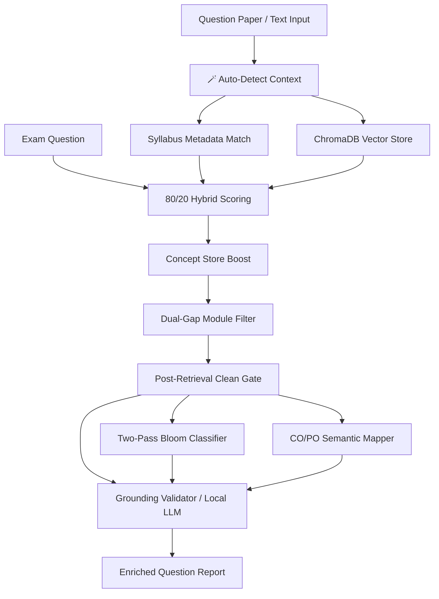

# AI Curriculum & Syllabus Validator

An institutional-grade, domain-agnostic hybrid AI system designed to automatically audit exam questions against university syllabi, map course outcomes, and classify question complexity using Bloom's Taxonomy.

---

## 🚀 Key Achievements & Features

The system has evolved from a naive semantic retriever into a robust, context-aware curriculum audit suite. Below are the core engineering milestones implemented:

### 1. Curriculum-Driven Ingestion Flow (Two-Phase Ingestion)
- **Phase 1: Parse & Preview (`/parse_curriculum`)**
  - Autonomously segments multi-subject curriculum PDFs, text, or public URLs.
  - Dynamically extracts administrative and academic metadata: Department, Semester, Program, Subject Code, Subject Name, Elective Type, and a **Metadata Confidence** metric.
  - Extracts module lists and displays text previews, allowing faculty to inspect extracted syllabus blocks *before* vectorization.
- **Phase 2: Selective Ingestion (`/ingest_selected`)**
  - Faculty selects which parsed subjects to vectorize, preventing vector database pollution and saving compute.

### 2. Pre-Embedding Quality Gate & Noise Sanitization
- **Boilerplate Stripper (`chunk_quality.py`):** Evaluates content-to-noise ratio in each text chunk. Automatically purges low-information administrative boilerplate (credit counts, lecture hours, textbooks, citation indexes, syllabus page headers/footers) prior to vector database insertion. This reduces vector database noise by **>95%**.
- **Bibliographic Noise Gate (`_is_reference_entry`):** Uses strict regular expression and semantic publisher keyword matching to identify and discard textbook lists, author credits, and standard citations masquerading as course topics.

### 3. Advanced Hybrid Retrieval & Score Gating
- **80/20 Hybrid Matcher:** Combines dense semantic retrieval (`SentenceTransformer` using the highly optimized `multilingual-e5-base` model) with direct exact-match technical lexical overlap (lexical similarity check) inside a hybrid scoring system (80% semantic weight, 20% lexical weight).
- **Dynamic Concept Expansion Boost (`concept_expander.py`):** Uses an NLP pipeline (spaCy noun chunks, capitalized entities, acronyms) to build subject-local concept indices. When analyzing a question, the system semantically evaluates concept alignment and applies a boost (+0.12 for strong, +0.06 for moderate overlap) to resolve synonyms and academic paraphrasing (e.g., matching "eliminate redundancy" to "normalization") without hardcoded whitelists.
- **Strict Semantic Thresholds:** Implements strict similarity thresholds (0.90 Strong Match, 0.72 No Match) with early deterministic rejection. Questions failing to meet the gatekeeper threshold are rejected as `OUT_OF_CURRICULUM`, avoiding redundant LLM inference and preventing hallucinations.
- **Dual-Gap Cross-Module Filtering:** Keeps the top match and dynamically evaluates subsequent matches. Keeps additional chunks *only* if they belong to the same module and fall within a 2% similarity gap, or belong to a different module and fall within a 4% similarity gap. This prevents irrelevant chunks from creeping in while perfectly capturing cross-module questions.

### 4. Rich Pedagogical Mapping
- **Hybrid Two-Pass Bloom's Taxonomy Classifier (`bloom_classifier.py`):** Combines fast, deterministic cognitive action-verb mapping (scanning in descending order: Create → Evaluate → Analyze → Apply → Understand → Remember) with a fallback WH-question heuristic router. Matches complex exam question forms (e.g., "Why does X work?", "What are the trade-offs of Y?") with extreme reliability.
- **Course Outcome (CO) & Program Outcome (PO) Mapper (`co_mapper.py`):** Ingests course learning outcomes and maps exam questions semantically to the closest CO and PO, producing institutional alignment logs.

### 5. Automated Context Detection & Hydration
- **🪄 Auto-Detect Context (`/detect_subject`):** Allows faculty to paste a question paper or upload a PDF. The system extracts subject metadata via structured regex and queries ChromaDB (first 1000 characters) to semantically identify and automatically select the matching syllabus.
- **Startup Hydration Engine:** On startup, the server automatically scans and hydrates the in-memory syllabus index from persistent ChromaDB collection meta tables, ensuring consistency after backend server restarts.

### 6. Automated Baseline Evaluation Suite
- **Reproducible Pipeline (`run_evaluation.py`):** An independent academic benchmarking tool that processes hundreds of syllabus-question pairs to generate definitive evaluation metrics (Accuracy, Precision, Recall, F1-Score) and a detailed confusion matrix heatmap.
- **Interactive Data Seeder (`seed_dataset.py`):** Enables faculty to instantly auto-generate labelled `IN_SYLLABUS` and `OUT_OF_SYLLABUS` testing data based directly on the ingested curriculum collections.

---

## 🏗️ Architecture Overview

The system is built as a highly decoupled, modular hybrid pipeline where **vector embeddings handle retrieval, deterministic rules enforce bounds, and local LLM reasoning provides explainable justification**.



### Technical Stack
- **Frontend:** React (interactive, responsive faculty validation dashboard)
- **Backend:** Python, Flask (modular microservices architecture)
- **Vector Database:** ChromaDB (persistent local storage, HNSW cosine index)
- **NLP / Embeddings:** spaCy (`en_core_web_sm`), SentenceTransformers (`multilingual-e5-base`)
- **Local Inference:** Mistral 7B (deployed locally via llama-cpp for total privacy and zero API costs)
- **Document Processing:** pypdf, Advanced regex parsers

---

## ⚙️ How It Works (The Ingestion & Analysis Pipelines)

### Phase A: Syllabus Ingestion Pipeline
1. **Curriculum Segmentation:** Large PDF or URL curricula are parsed into distinct subjects.
2. **Boilerplate Filtering:** Raw texts are chunked and evaluated. low-information sentences are purged.
3. **Reference Book Filtering:** Bibliographic listings are stripped out.
4. **Vector Embeddings:** Valid chunks are embedded via `multilingual-e5-base` and stored in ChromaDB.
5. **Concept Indexing:** Noun-phrase and capitalized concepts are indexed in the `concept_store` collection.

### Phase B: Question Analysis Pipeline
1. **Context Loading:** Syllabus metadata is loaded.
2. **Hybrid Semantic Matching:** Embeds question, retrieves top-k chunks, combines cosine similarity with exact keyword overlap.
3. **Concept Boosting:** Evaluates local concept alignment, applying a boost if concepts overlap.
4. **Similarity Threshold Gate:** Rejects early if the hybrid score is < 0.72.
5. **Dual-Gap Filtering:** Retains relevant cross-module nodes, discarding peripheral noise.
6. **Bloom & CO/PO Evaluation:** Determines cognitive difficulty and maps to academic outcomes.
7. **Explainable Validation:** Local LLM uses retrieved grounding chunks to output a YES/NO validation and detailed justification.

---

## 🔌 API Reference

### 1. Ingestion Endpoints

#### `POST /parse_curriculum`
Parses curriculum text, PDF files, or URLs and returns detected subject blocks without embedding.
- **Request Type:** Form Data or JSON
- **Body Parameters:**
  - `mode`: `"pdf"` | `"url"` | `"text"`
  - `file`: (If mode is `pdf`) Multipart PDF file upload
  - `url`: (If mode is `url`) String URL to fetch
  - `text`: (If mode is `text`) Raw curriculum text
- **Response Format:**
```json
{
  "parse_id": "a5b810da-...",
  "segments": [
    {
      "syllabus_id": "IT-VIII-PEC-IT801B",
      "curriculum_department": "Information Technology",
      "department": "Information Technology",
      "semester": "VIII",
      "subject_code": "IT801B",
      "subject_name": "Cryptography and Network Security",
      "elective_type": "PEC",
      "metadata_confidence": "High",
      "modules": ["Unit I: ...", "Unit II: ..."],
      "text_preview": "Syllabus content preview...",
      "already_ingested": false
    }
  ]
}
```

#### `POST /ingest_selected`
Vectorizes and embeds selected subjects from a prior parsing session.
- **Request Type:** JSON
- **Body Parameters:**
```json
{
  "parse_id": "a5b810da-...",
  "syllabus_ids": ["IT-VIII-PEC-IT801B"],
  "ingest_all": false
}
```
- **Response Format:**
```json
{
  "success": true,
  "ingested": ["IT-VIII-PEC-IT801B"],
  "skipped_duplicates": [],
  "chunks_generated": 42
}
```

#### `POST /ingest_from_url`
Directly download, parse, and embed a syllabus from a URL.
- **Request Type:** JSON
- **Body Parameters:**
```json
{
  "url": "https://example.com/syllabus.pdf",
  "department": "Information Technology",
  "semester": "VIII",
  "subject_code": "IT801B",
  "subject_name": "Cryptography and Network Security"
}
```

---

### 2. Operational & Analysis Endpoints

#### `POST /detect_subject` (🪄 Auto-Detect Context)
Extracts metadata from pasted question papers or uploads to match a loaded syllabus.
- **Request Type:** Form Data or JSON
- **Body Parameters:**
  - `mode`: `"text"` | `"pdf"`
  - `text` / `file`: Raw text or PDF
- **Response Format:**
```json
{
  "success": true,
  "metadata": {
    "syllabus_id": "IT-VIII-PEC-IT801B",
    "subject_code": "IT801B",
    "subject_name": "Cryptography and Network Security",
    "department": "Information Technology",
    "semester": "VIII"
  }
}
```

#### `POST /analyze_question`
Performs comprehensive auditing, indexing, and validation for single or batch exam questions.
- **Request Type:** Form Data or JSON
- **Body Parameters:**
  - `mode`: `"text"` | `"pdf"`
  - `question` / `file`: Raw question string or PDF question paper
  - `syllabus_id`: The ID of the syllabus to validate against
  - `threshold`: Gatekeeper similarity threshold (defaults to `0.72`)
- **Response Format (Single Mode):**
```json
{
  "mode": "single",
  "question": "Explain the working of RSA cryptosystem.",
  "similarity_score": 0.92,
  "is_in_syllabus": true,
  "gatekeeper_passed": true,
  "reason": "Successfully grounded in Unit III: Public Key Cryptography",
  "retrieval_status": "MATCH_FOUND",
  "match_strength": "STRONG_MATCH",
  "match_type": "IN_CURRICULUM",
  "modules_detected": ["Unit III: Public Key Cryptography"],
  "bloom_level": "Understand",
  "difficulty": "Easy",
  "mapped_co": "CO2",
  "mapped_pco": "PO2",
  "llm_decision": "YES",
  "llm_justification": "The question asks for the working of the RSA cryptosystem, which is explicitly covered in public key cryptography topics within Unit III.",
  "llm_module": "Unit III: Public Key Cryptography",
  "top_chunks": [
    {
      "text": "Unit III: Public Key Cryptography, RSA cryptosystem, Key generation, Encryption and Decryption algorithms.",
      "similarity": 0.92,
      "module": "Unit III: Public Key Cryptography"
    }
  ]
}
```

#### `GET /curriculum_hierarchy`
Generates the nested metadata structures (Department → Semester → Subject) directly from vector storage.
- **Response Format:**
```json
{
  "departments": {
    "Information Technology": {
      "VIII": [
        {
          "syllabus_id": "IT-VIII-PEC-IT801B",
          "subject_name": "Cryptography and Network Security",
          "subject_code": "IT801B",
          "elective_type": "PEC"
        }
      ]
    }
  }
}
```

---

## 🚀 Setting Up the System

### Backend Setup
1. **Navigate to the Backend Directory:**
   ```bash
   cd backend
   ```
2. **Set Up virtualenv & Activate:**
   ```bash
   python -m venv .venv
   # Windows:
   .venv\Scripts\activate
   # Linux/macOS:
   source .venv/bin/activate
   ```
3. **Install Dependencies:**
   ```bash
   pip install -r requirements.txt
   python -m spacy download en_core_web_sm
   ```
4. **Run the Flask Server:**
   ```bash
   python app.py
   ```
   The backend will run on `http://127.0.0.1:5000` and auto-hydrate itself.

### Frontend Setup
1. **Navigate to the Frontend Directory:**
   ```bash
   cd frontend
   ```
2. **Install Dependencies:**
   ```bash
   npm install
   ```
3. **Run the React Dev Server:**
   ```bash
   npm run dev
   ```
   The interactive dashboard will be hosted locally (e.g., `http://localhost:5173`).

---

## 🔮 Key Takeaway

> This project proves that successful AI implementation is not about building the largest LLM prompt. It is about **architecting deterministic, context-aware gates and pipelines around local AI components** to guarantee data privacy, academic rigor, and zero-hallucination accuracy.
